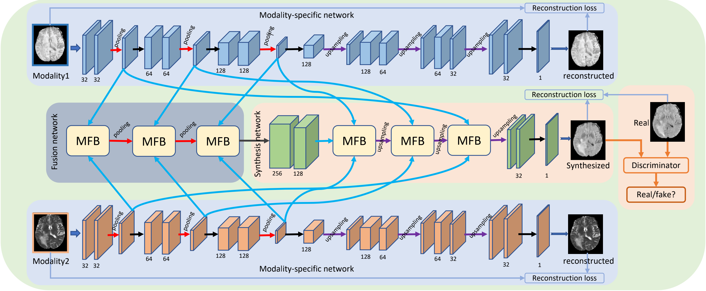

# Hi-Net

为了方便自己使用，创建的这个库，代码来源为：https://github.com/taozh2017/HiNet

Tao Zhou, Huazhu Fu, Geng Chen, Jianbing Shen, Ling Shao. "Hi-Net: Hybrid-fusion Network for Multi-modal MR Image Synthesis". IEEE Transactions on Medical Imaging (IEEE TMI), 2020. ([Offical version](https://ieeexplore.ieee.org/abstract/document/9004544))([arXiv version](https://arxiv.org/pdf/2002.05000.pdf))

